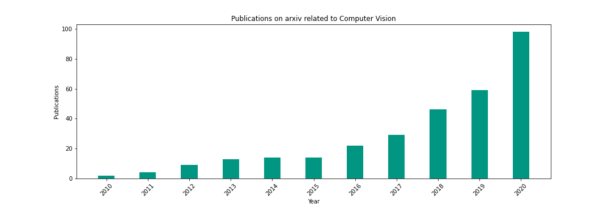

Quick Service Restaurant Order Assistant (QSROA) - Business Plan
================================================================

Mission Statement
-----------------

We, Christian, Felix, Julian, Joshua, Leon and Magnus are a group of
students, all with a fascination in machine learning and a willingness
not only to learn about ML techniques but also to "get our hands
dirty" and use our theoretical knowledge and expand it practically. As
participants of the AISS-CV (Artificial Intelligence in Service Systems - Computer Vision) course, we had the task to invent a Computer Vision
service solution deployable on a "Jetson Nano". Put another way, we
had to develop a service running on a computer attached to a camera that
detects objects in real-time with the help of a neural network. Quickly
we realized that our invention could be a game-changer for our potential
customer market. In the following analysis, we will elaborate on this.

Our overall goal is to create profit for our customers as well as for
their customers - or to say in a prosaic way "make our customers happy
by making their customers happy".

Breaking down our overall goal to a more fine-granular level, we will
examine the service we provide, the primary market where the most profit
with our service can be made and, where for now our geographical region
of operations will be.

We invented an AI-order-assistant for Quick Service Restaurants to check
the completeness of an order.

Incorrect order composition is not only a major source of
dissatisfaction for customers eating at the restaurant - especially
in-home deliveries the damage done is significantly higher to both the
restaurant and the customer.

On the customer's side, the level of frustration rises as the
correction of the faulty delivery takes time. On the restaurant side,
the company now not only has to deal with preparing the missing products - 
both an additional material and time expense, it additionally has to
deliver those as quickly as possible to the customer, a rather costly
process. Like that isn't enough, the damage done to the company's
image grows with every minute the customer has to wait for her correct
order.

*With QSROA we intend to eliminate the occurrence of this inconvenient
process once and for all!*

In times where the market for food delivery is on the rise ([Revenue
Germany Food-Delivery 2020: 4.0 billion €, 2025: estimated 6.9 billion
€](https://de.statista.com/outlook/dmo/eservices/online-food-delivery/deutschland#umsatz)),
our solution can save restaurants from high costs.

At the moment, we see our solution mainly in the area of large quick
service restaurant chains, as there is a maximum standardization of the
menu (packaging) and we believe that we can "make our customers happy
by making their customers happy" the fastest here.

As we constructed our service always trying to keep it as simple as
possible - we believe we aren't restricted geographically, neither do
we have to adapt much to geographically different market situations.

Business Description
--------------------

Many quick-service restaurants, especially in the fast-food industry are
facing a similar challenge - large amounts of orders hit employees with
time being a limited and valuable factor. These orders can reach high
levels of complexity and contain a vast variety of products. As a
result, selecting and packing the right menu items (now simply called
items) turns into a crucial and error-prone task that requires a
constantly high level of focus.

Mistakes made typically result in costly fixes, a lowered customer
satisfaction and reputation damages in the long run.

The Quick Service Restaurant Order Assistant (QSROA) developed in the
course of this lecture, therefore, aims to help employees through the
order handling process by verifying the status of the current order. In
addition, the time-consuming process of frequently re-reading the order
on receipts can be minimized and thus orders can be processed faster.

Using a camera surveying the packing area, the assistant continuously
collates the detected items with the current order. QSROA thereby guides
the employee not only towards missing items but also wrong ones and
verifies the status of the order.

We as a group want to create value to the market by entering into
collaborations with our business partners, not presenting them a fixed
product, but rather adapt our service to their needs and overcome
different chain-specific challenges in direct discourse. Our solution
can be broken down into the following main parts:

-   Hardware:

    -   an edge device with an attached camera

-   Software:

    -   real-time menu item detection running on the edge device

    -   web-based interface collating detected items with the current
        order

-   Service:

    -   software maintenance

    -   updating network corresponding to seasonal menu-changes

    -   future work: bottleneck detection - tracking how long it takes
        to produce certain menu items.

To get a better system overview, in the following a simplified
representation of QSROA in the field of application is shown.

The system consists of three main parts. A camera module\[1\] and a
monitor\[2\] connected to a Nvidia Jetson Nano, a packing area\[3\] and
an employee\[4\] interacting with the QSROA.

Once a new order is placed in the system, the monitor displays its
requested items to the employee. The job of the employee is now to
collect the required items and place them in the packing area. The
camera captures the items and sends the image to the Jetson Nano, where
a custom-trained neural network is working to detect the items/objects
in the image. The items are then transferred to the new status "checked
off". As soon as all of the items have been detected, the order can be
marked as complete and the employee may pack the ordered menu and
proceed with the following menu request.

In conclusion, our system serves as an easy-to-implement, additional
verification instance capable of significantly reducing costs caused by
human failure in the processing of orders.

Deployment and Maintenance
--------------------------

One of the key features of the QSROA is that the whole system can be run
on a single Jetson Nano. In order to put the system into use the
customer essentially only needs to install the device and create a
connection to a display as well as the customer's checkout system.

The establishment of a connection to the checkout system represents the
most complex step in the deployment as it most likely requires a
modification in the customer's system. However, as our customers are
forecasted to be mostly large chains, a standardization and therefore
simplification of this process can be expected.

The simplicity of the assistant continues in the dataset used for
training the neural network. The training data largely/purely consists
of synthetic data, thereby needing relatively few of it.
This helps to provide a very convenient maintenance process as the model
of the QSROA can be retrained easily and cost-effectively, again only
needing few data.
Thus, the assistant can react especially well to minor or seasonal
changes in the restaurant's menu.

Impact for Potential QSROA-Customers
------------------------------------

Potential customers range from large quick service restaurant chains to
small company cafeterias. They all share the problem of occasionally
trying to avoid employees having to perform monotonous work for long
periods of time, which is often error-prone in the long run and can for
example end up in packing orders that don't fulfill what the customer
asked for.

This problem becomes even more severe in situations where orders cannot
be fixed after leaving the kitchen, namely in food deliveries. The costs
of faulty deliveries are significant. Not only do restaurants have to
send out another delivery, but they may also lose the goodwill of the
customer thereby potentially reducing future orders.

Especially the potential damage in reputation is not to be neglected. As
a saying goes, "*It takes years to build a positive image, but only five
minutes to ruin it"*. With our new assistant, QSROA customers can take
another step towards preserving their hard-earned reputation by further
minimizing situations that may cause customer dissatisfaction.

Monotonous work not only dissatisfies employees and as a result
motivates them to look for new job opportunities, but also can
negatively impact mental health ([Judy Willis
2014](https://doi.org/10.1177%2F003172171409500807)) and lead to
error-prone work performances. Since it is in the interest of a company
to avoid employees dropping out for an unpredictable time, it is
important to restrict monotonous workflows.

By implementing the QSROA into a kitchen workflow, it is also possible
to document event-logs/timestamps of the ordered items when they are
ready for packing. With process-mining techniques, it is then possible
to detect and visualize bottlenecks in the kitchen workflow and further
optimize the process to reduce the overall menu delivery time.

SWOT Analysis
-------------

**Strengths:**

-   agile development-team

-   simple solution

-   relatively easy to large scale our service (country-wide)

**Weaknesses:**

-   Little knowledge in quick-order restaurant domain

-   No full-time development (students)

**Opportunities:**

-   Growing food-delivery market

**Threats:**

-   High pressure due to easy replaceability in early-stage development
    (less domain knowledge)

Industry Background
-------------------

**Quick service restaurants (QSR)-Industry:**

There are many different quick service restaurant brands like Burger
King, McDonald's, Starbucks, Taco Bell, etc.. In the U.S. alone, this
industry generated revenue of 239 billion U.S. dollars in 2020 ([S.
Lock
(2020)](https://www.statista.com/statistics/196614/revenue-of-the-us-fast-food-restaurant-industry-since-2002/)).
The Food-Delivery-Industry on the other hand generated 28 billion U.S.
dollars of revenue in the U.S. in 2020
([Statistica](https://de.statista.com/outlook/dmo/eservices/online-food-delivery/usa?currency=USD\#umsatz)).
For now we will not focus on limited service restaurants (LSR), because
it is easier to large-scale our solution for standardized
restaurant-chains. As the markets for QSR and food deliveries are
growing constantly not only in the U.S. but also worldwide, it is
essential to build an easy-to-implement solution to serve this growing
market.

**Computer Vision Research:**

Since we expect further growth in the field of computer vision, we can
also expect more advanced techniques to improve our service.

Competitor Analysis
-------------------

Our biggest competitor is probably [auvisus](https://auvisus.com/en/)
but they for now have a different scope - they focus on canteens, not on
QSR chains. Therefore, we will not have any problems since we operate in
different markets.

Market Analysis
---------------

In the early stages, our product exclusively targets large QSR chains.
Their rare menu changes as well as internally motivated high product
recognizability allows for a large-scale deployment with a low need for
individualization.

We reckon with a sales potential of over 1.000 devices within the first
three years, as BurgerKing and McDonalds already operate over 57.000
restaurants worldwide. Since our product is barely affected by regional
factors, we believe that every single one of the restaurants could
potentially be equipped with one or more QSROAs, depending on their
size. In addition, with the turnover in food deliveries presumably
doubling between 2019 and 2025 ([Online Food Delivery - worldwide](https://de.statista.com/outlook/dmo/eservices/online-food-delivery/weltweit\#umsatz)),
the need for accurate delivery processes and assisting technologies will
increase even further.

While focusing at first on the large QSR companies comes with several
advantages, it also connects QSROA to the problems of *"classic"* QSR
chains, namely the shifting perspective of customers towards healthier
and more eco-friendly products. However, as the demand for fast food
itself does not decrease, we see ourselves very much in the position to
extend our target audience after the initial phase to new emerging QSR
companies.

Outlook
-------

While the QSROA can be a value-adding instrument in its initial use
already, there are potential further scenarios in which the QSROA may
deliver value to customers.

With the integration of the QSROA into a kitchen workflow, it is
possible to document the event logs/timestamps of ordered items once
they are placed in the scope of the QSROA and ready for packing. With
the time tracking our customers have the ability to use process mining
tools to detect bottlenecks and improve their kitchen processes to
reduce the overall menu delivery time.

The most prominent use case appears to be in a self-serving environment.
Essentially, the QSROA could be used as a verifying instance to check
whether customers pick the products they paid for. In an even more
advanced version, the customer's bill would be based upon the products
the customer picked and the QSROA detected.
In both scenarios the need for employees would significantly decrease,
hence increasing our customer's competitiveness in the market through
reduced costs and increased customer satisfaction.
