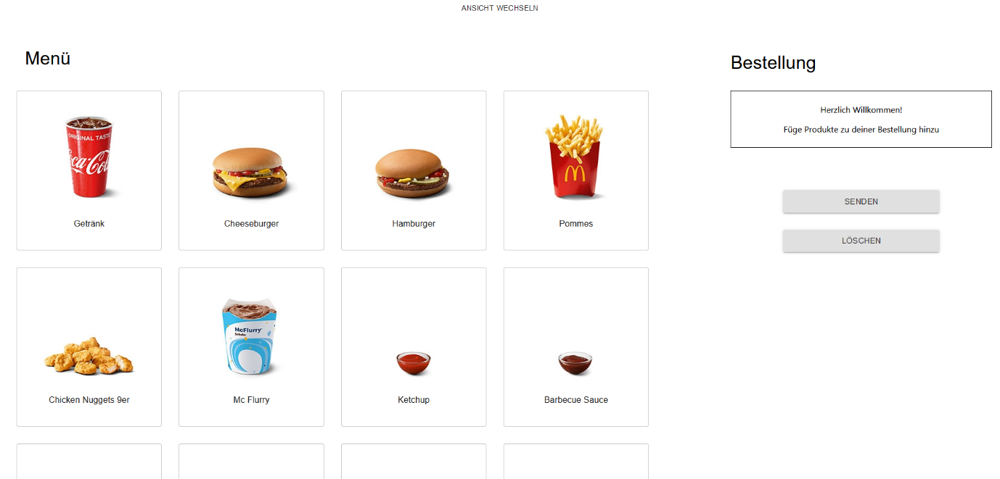

System Architecture
===================

The QSROA system consists of three independent components: the inference
pipeline, a backend and a frontend. The inference process takes care of
the deployment of our model and provides an RTSP video stream. The
backend is responsible for the logical analysis of the detected objects
and the frontend is used to display the results and furthermore
demonstrates a use case.

In the following figure the parts of our systems are illustrated. The
frontend is developed by using React, Material-UI and nginx. It
communicates with the backend via Socket.IO and REST Endpoints. The
backend is developed with Flask, Socket.IO and gunicorn. The inference
pipeline is based on Nvidias DeepStream SDK for Python and sends data on
detected objects to the backend via a Socket.IO connection.

All three components are deployed using Docker. The components are
described in detail in the following paragraphs.


Inference
---------

Due to the confined availability of resources, hardware limitations can
pose a significant challenge for the deployment of computer vision
models on portable and low-power devices. Therefore, the characteristics
of target platforms must be carefully considered when designing a model.
However, driven by the increasing demand for on-device AI and mobile
gaming, powerful mobile SOCs, offering both, high graphics performance
and specialized hardware for machine learning tasks, have become widely
available. Nevertheless, utilizing the full potential of these platforms
often involves the use of proprietary frameworks and is consequently
still a cumbersome process. While the performance of the Nvidia Jetson
Nano platform, as the target platform for this project, is easily
outperformed by more recent devices such as modern smartphones, it still
offers access to a rich ecosystem of GPU-accelerated frameworks provided
by Nvidia.

Most common machine learning frameworks, including TensorFlow and
PyTorch, offer support for GPU-accelerated inference backed by [Nvidia
CUDA](https://developer.nvidia.com/cuda-zone). However, [Nvidia
TensorRT](https://developer.nvidia.com/tensorrt) is the preferred
inference framework for the deployment of deep learning models on Jetson
devices. It maximizes throughput and reduces latency by automatically
applying various optimization techniques. While the inference step is
most resource-demanding, creating a real-time computer vision
application involves numerous other processing steps. First, the image
must be preprocessed and transformed to the format required by the
inference engine. Following this step, the model output has to be
processed (e.g. performing Non-maximum Suppression, drawing bounding
boxes). Finally, depending on the required output format, the video
stream needs to be encoded. Specialized and highly performant frameworks
such as OpenCV for video processing are available for all these steps. A
basic approach to creating a processing pipeline would involve
sequentially passing data between these steps in a loop. While this can
deliver decent results, it creates plenty of overhead. Most noticeably,
data must be copied between GPU and CPU memory multiple times.

There are several approaches for addressing those shortcomings. After
extensive investigation, we figured that Nvidia's [DeepStream
SDK](https://developer.nvidia.com/deepstream-sdk) best matches the
requirements for the QSROA project. As a framework specifically targeted
towards the development of AI-powered intelligent video analytics apps
and services, it offers a high level of flexibility and customizability.
Resulting from a tight integration into the Jetson ecosystem, it also
offers superior performance to other solutions.

DeepStream is based on the popular pipeline-driven media framework
[GStreamer](https://gstreamer.freedesktop.org/) and extends upon it by
implementing a range of additional plugins specifically targeted towards
AI applications. These plugins are optimized for Jetson devices and
Nvidia Datacenter GPUs. As such it allows for the integration of
TensorRT inference into a GStreamer media pipeline.


Technical Details
-----------------

The QSROA inference solution is implemented using the DeepStream SDK for
Python and consists of two major components. The DeepStream pipeline
itself and a Python script responsible for managing the pipeline process
and communication with the backend.

The DeepStream pipeline takes the input image provided by the CSI-Camera
attached to the Jetson Nano. The generated GStreamer buffers are passed
through the pipeline, applying different preprocessing steps such as
downsizing the input image. Data is then passed to the
[Gst-nvinfer](https://docs.nvidia.com/metropolis/deepstream/dev-guide/text/DS_plugin_gst-nvinfer.html)
component responsible for TensorRT inference. Further details on
inference are explained in section [TensorRT
Inference](#TensorRT-Inference). As part of inference metadata
containing information on recognized objects and more are attached to
the buffers. After inference buffers are (optionally) passed to the
[Gst-nvtracker](https://docs.nvidia.com/metropolis/deepstream/dev-guide/text/DS_plugin_gst-nvtracker.html)
component executing unique object tracking. The output image is then
processed further (e.g. bounding boxes are drawn) and is either output
as a windowed video stream on the Jetson device or as a low-latency RTSP
video stream. As RTSP is a common streaming protocol for IP cameras and
CCTV surveillance, it is most likely already in use at the majority of
POS locations. QSROA customers may therefore choose to integrate this
stream into their existing systems.


TensorRT Inference
------------------

While Nvidia provides samples for the deployment of YOLO models using
TensorRT and DeepStream, newer YOLO models such as the YOLOv5 model used
by the QSROA are not yet supported. However, the provided source can be
updated to support these models.

As such, there is an official [TensorRT implementation of
YOLOv5](https://github.com/wang-xinyu/tensorrtx/tree/master/yolov5) that
can be used to obtain a TensorRT engine file upon compilation. This
engine can then be used along with the necessary nvinfer plugin provided
by the
[DeepStream-Yolo](https://github.com/marcoslucianops/DeepStream-Yolo)
project on GitHub. Updates were applied to both projects' source code
to match QSROA requirements.

Object Tracking and Skip-Inference
----------------------------------

The
[Gst-nvtracker](https://docs.nvidia.com/metropolis/deepstream/dev-guide/text/DS_plugin_gst-nvtracker.html)
plugin can be used to track detected objects in DeepStream pipelines.
This allows assigning unique ids to objects and tracking their movement
over time. The DeepStream SDK provides three different low-level tracker
implementations that can be chosen depending on project requirements.
Unique object tracking could therefore be used to implement more
advanced features. However, this functionality is not yet used for the
QSROA.

As object trackers typically consume noticeably fewer resources than
TensorRT inference, they can also be used to optimize perceived video
stream performance. The QSROA DeepStream pipeline achieves this by
skipping inference for every 2^nd^ frame. As objects are tracked by the
tracker component, bounding boxes can still be updated every frame,
resulting in almost doubling the framerate while still being able to
keep track of detected objects. Applying skip-inference is vastly
beneficial for model selection as it allows for the deployment of models
that would otherwise be too large for delivering an acceptable
framerate. This even allows for the deployment of a YOLOv4-CSP or
full-size YOLOv4 model on a Jetson Nano as demonstrated in the section
model.

Statistics Collection
---------------------

To supply the backend with necessary information it is required to
extract the metadata from the stream. For DeepStream pipelines, it is
common practice to insert a (blocking) callback before the
[Gst-nvdsosd](https://docs.nvidia.com/metropolis/deepstream/dev-guide/text/DS_plugin_gst-nvdsosd.html)
component, which is amongst other things responsible for drawing
bounding boxes. The callback receives the buffers that would otherwise
be directly passed to the nvdsosd component. This allows for applying
changes to the metadata or adding additional text to be drawn. As by
that time the buffers already contain all the necessary metadata, it can
also be used to collect the information required by the backend.

We do this by counting all objects in a frame (grouped by class). The
information is then added to a global two-dimensional dictionary. The
first index of this dictionary corresponds to the label of the object
class whereas the second object corresponds to how often this class
appears in the frame. The integer value is incremented by one for each
key-pair obtained from counting objects in the frame. Every second this
dictionary is submitted to a [multiprocessing
queue](https://docs.python.org/3/library/multiprocessing.html#pipes-and-queues)
along with a timestamp and the total number of frames since last
submitting to the queue. The dictionary is afterward cleared.

The Python script responsible for managing the inference process
collects the information from the multiprocessing queue and acts as a
[Socket.IO](https://socket.io/) client that sends the data to the
backend for further processing. The following example shows the format
of the dictionary sent to the backend. As can be obtained from the
information contained in the dictionary, two objects of class *beverage*
were detected in 2 of the last 20 frames while three objects of class
*beverage* were detected in 18 frames. An object of type *fries* was
detected in all 20 frames.

```json
{
    'frames_since_last_report': 20, 
    'objects': {
        'beverage': {
            '2': 2, 
            '3': 18
        }, 
        'fries': {'1': 20}
        }, 
    'timestamp': 1625162677116201
}
```


Backend
-------

In the case of the QSROA, the backend has the central task of bringing
together the results produced by the model with the logic and
functionality necessary in order to deliver the advanced service.

Its structure and way of functioning should therefore be described
below.

### Structure

The backend has been created with Flask. It is constructed through
python Socket.IO and REST endpoints which may be described in the
following:

``/send-orders``: <br>
expects a JSON object in the format of

```json
{
    'item': number_of_items
}
```

example:

```json
{
    'cheeseburger': 1,
    'hamburger': 3,
    'chickenburger': 2,
}
```

``/delete-orders``: <br>
delete all orders

Additionally, the inference process, described in the previous
paragraph, subscribes to the Socket.IO connection ``statistics``. The
inference client sends a JSON object containing statistical data at a
frequency of 1 Hz.

The frontend subscribes to the Socket.IO connections *actual-order* and
*orders*.

### Functionality

The functionality of the backend crucially involves a parameter named
``FRAMES``. The parameter describes the percentage of frames in which an
object must be detected by the model in order to be interpreted as an
actual object. It therefore can take on values in the range of [0, 1]
and functions as a noise filter.<br>
In the scope of the lecture this value has arbitrarily been set to 0.8.
However, going forward it can certainly be optimized empirically.

``FRAMES`` is then subsequently used to calculate another variable
``min_frames``, with ``min_frames`` = ``FRAMES`` * ``frames_since_last_report``.
With this ``min_frames`` calculates the product of ``FRAMES`` and the number of
frames captured since the last statistical analysis
(``frames_since_last_report``). It therefore acts as the lower bound for the
number of frames an object must be detected in to actually be considered
an object by the QSROA. With ``min_frames`` being determined, for every item
class in the statistical data provided, the following calculation is
being conducted:

For every item class the number of items gets identified. This happens
by identifying the maximum number of instances of an item class for
which the ``min_frames`` requirement is being fulfilled.<br>
For clarification consider the following example:

> ``min_frames`` has been calculated as twelve.<br>
> The model detected exactly four beverages in 3 frames, exactly three
> beverages in 11 frames and exactly two beverages in 2 frames.
> Obviously, if the model detects four beverages it implicitly detected
> two and three beverages as well.<br>
> As four beverages are detected in less frames than ``min_frames`` it gets
> discarded. Both three and two beverages got identified in more than 12
> frames (three in 3+11 and two in 3+11+2). The three beverages
> therefore equal the maximum item of numbers, so that the statistical
> calculation returns the result number of beverages is three.

Thus, the calculation returns a list containing class items and their
respective quantity.

In a final step the calculated list is then compared with the current
order, resulting in three lists.

 - correct: Products that have been detected as well as found in the
 order
 - missing: Products that have been found in the order but not detected
 - incorrect: Products that have been detected but not found in the order

The three lists as well as the next eight elements of the order queue
are then sent to the frontend via the Socket.IO connections.

### Notes

The systems processes orders by the FIFO principal.

In order to be able to develop and test the backend independently from
the jetson or rather the inference process, the backend has been
extended by the file ``mock.py``. With execution a Socket.IO connection to
the backend is being established. Via the connection a JSON object
containing the statistical data is being sent to the backend either in
predefined temporal intervals or by operating the enter-button.

For further information on the deployment, we refer to the chapter
deployment. More information on how to run the backend as well as some
hints can be found in the README of the backend directory.


Frontend
--------

As we intend to demonstrate the QSROA and its functionalities in a best
possible and most realistic scenario, our project includes two frontends
for distinct application areas.<br>
The first frontend focuses on our customer's customers by providing a
checkout system.<br>
The second view displays the central features of our service, serving as
an order control screen to our customer's employees.

For reasons of simplicity both frontends have been developed within the
same project.

### The Checkout System

The checkout system functions as a classic checkout system. It enables
the restaurant's customers to put in their orders. The orders may be
composed of an arbitrary combination of the items shown in the UI. It
has been designed so that the input can take place via tablets and is
touch-capable, therefore resembling current implementations of QSR
chains.<br>
To submit an order, the send button must be pressed. To delete the
current selection, one must press the delete button.

In a field project the checkout system would be replaced by our
customers checkout
system.


### The Order Control Screen

The order control screen is the central visual element of the QSROA as
it brings together the functionalities of the neural network and backend
with an UI that enables the employees to profit from the added value.<br>
It is the view that our customer's employees are intended to work with.
The order control screen can be separated into two parts.<br>
The first part displays the current order, meaning the current order the
employee is supposed to process. The UI supports the employee by
differentiating between items that have been added correctly so
(complete) and those that are still missing (missing). Additionally, it
also warns the employee of items that have been added mistakenly to the
order (incorrect).<br>
To further support the employee the three categories get clarified by
the use of a traffic light scheme.

The second part of the screen shows the subsequently following orders,
so that the restaurant can act participatory and optimize its processes.


### Development Process

The frontend has been developed with React. For the creation of the app
create-react-app was used. For the design the Material-UI package was
added to the project. As a client for REST axios was chosen, for
WebSocket connections the interfaces make use of Socket.IO.<br>
The source of pictures utilized in the checkout system UI has been
McDonald's
([McDonald's](https://www.mcdonalds.com/de/de-de/produkte/alle-produkte.html)).<br>
The structure of the UI is component based. Exemplary components are
order lists and the traffic light list.
