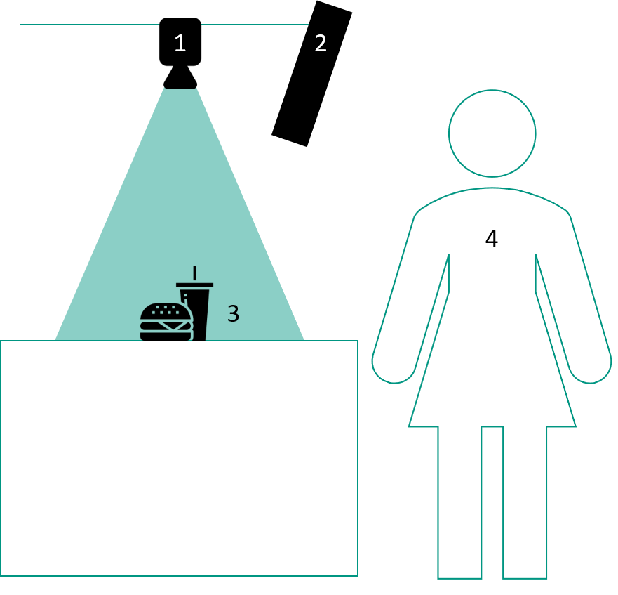
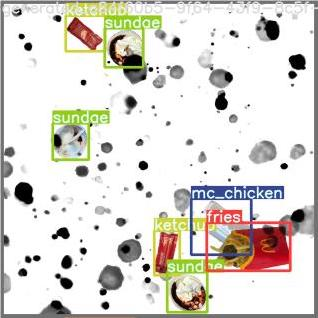
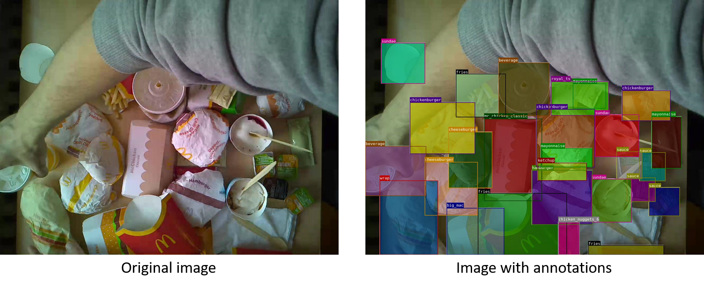
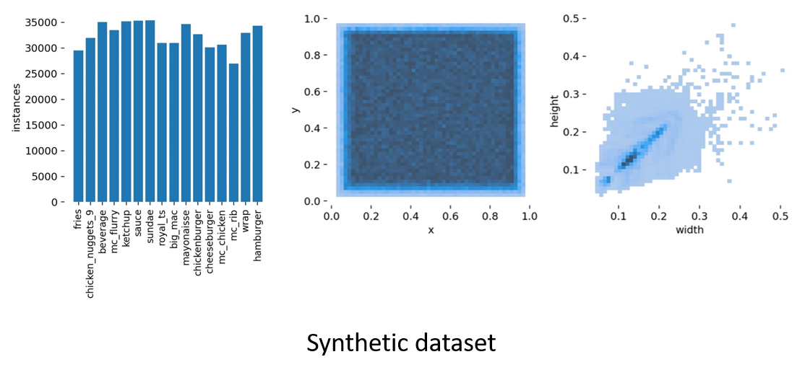

Dataset
=======

Data Generation
---------------

On consideration of the field of use of the QSROA, it becomes apparent
that the required object detection is limited to few types of objects
with instances having an extremely high level of similarity. Deducted
from this finding, we conclude that synthetic data as the main component
of the dataset is the ideal way to go. It combines a variety of
advantages. 
First, it is comparatively simple to generate a comprehensive dataset.
Further, generating a synthetic dataset is a rather time- and
resource-saving process. Finally, a synthetic dataset comes with a high
level of flexibility since it allows for easy retraining upon menu
changes.

### Items

The dataset consists of 15 objects. 14 of them are different items
purchasable at McDonald's. The 15th item is hands, because they will
often be seen by the QSROA once in action.

-   Fries

-   Hamburger

-   Cheeseburger

-   Big Mac

-   Hamburger Royal TS

-   McRib

-   McChicken Classic

-   Chicken McNuggets 9er

-   McWrap

-   McSundae

-   Softdrink

-   Ketchup

-   Mayonnaise

-   Sauce

-   Hands

### Requirements

When considering the requirements for the pictures that have been taken,
one must differentiate between single-item and multi-item images.

Single-item images are those that show only one object per picture.
Their main purpose is to use them for the creation of the synthetic
dataset. 
Multi-item images on the other hand, show multiple objects and can be
used for retraining the model. Later we will confront the model
performance trained purely on our synthetic dataset with the described
hybrid dataset achieved performance.

For both image categories, the area for the picture taken must be well
lit and the camera used needs to be positioned perpendicular to the
surface on which the items are being placed.

Further, in single-item images, shadows are to be avoided and there must
be no hands in the way. For each item a minimum of four pictures has
been taken while placing the images of the items in various positions on
the surface. The following figure shows our setup requirements for
taking images of the relevant objects to ensure consistency through our
synthetic dataset.

In multi-item images we value a realistic combination of objects. The
objects may slightly intersect each other, moreover, hands are allowed
as well, however, the items must remain recognizable. Each item in the
picture must be labeled with a bounding box of its category. Finally, it
is desired to get multiple pictures of identical compositions in
different spatial arrangements.

### Data Augmentation

The exact number of single-item images used for the generation of the
dataset can be seen in the following table.

The process of the generation goes the following. For every picture the
item is cut out. The resulting images are then scaled down to a
predefined resolution. The resulting images are ready to be used for the
synthetic dataset. 
For every synthetic picture, at first, we load a random background image
out of a selection. Then, out of the pre-processed images, a few are
randomly added to the picture. To increase diversity between images, we
apply additional transformations to the items. These transformations
include randomly rotating and warping the items to simulate different
perspectives as well as blurring the image to simulate an out-of-focus
effect.

Items may overlap, however no more than 50 percent. On top of the
classes, hands may be placed randomly to generate a more realistic
representation of what the final system may expect. 
After all items have been placed, random noise is introduced to the
final image. Noise includes black parts and spots over the image to
further discourage the network from memorizing rather than learning from
the images. 
Finally, the item position and size are saved. Since we initially
planned to use COCO-Format, our annotations were created in this
format. This means the annotation for all images from the dataset are
saved in a single JSON file. Since we later switched to using a YOLO
network, we had to convert the annotations into the new format. YOLO
requires a ``txt`` file with the class location for every image. 
An example of a resulting synthetic picture can be seen in the following
figure. The shown table displays the quantity of slightly different
images available for the synthetic dataset.

To test the data generation yourself, follow the [``DataGeneration.ipynb``](https://git.scc.kit.edu/upsla/case_study_ai_in_cv/-/blob/master/notebooks/DataGeneration.ipynb)
notebook.

  |Item-class              |Quantity
  |----------------------- |----------
  |Fries                   |19
  |Hamburger               |13
  |Cheeseburger            |5
  |Big Mac                 |13
  |Hamburger Royal TS      |15
  |McRib                   |7
  |McChicken Classic       |18
  |Chicken McNuggets 9er   |19
  |McWrap                  |24
  |McSundae                |26
  |Softdrink               |20
  |Ketchup                 |20
  |Mayonnaise              |14
  |Sauce                   |28
  |Hands                   |17

Final Dataset
-------------

Our final dataset consists of three different sets. A training dataset
used to train the model, a validation dataset used to evaluate the
model's performance while training and a test dataset to evaluate the
final model performance.

The training dataset consists of 45.000 synthetic images and an
additional 5000 random images with no classes to further regularize the
model. These 5000 images were taken from the COCO2017 dataset.

The validation dataset consists of 5000 images, 95% of which are
synthetic images, the remaining 5% are randomly selected stock images
containing no classes.

The test dataset consists of 160 real images that were labeled by hand.
These pictures were taken on the system that will be deployed to
customers. Distance, camera, lighting, etc. are as specified to gain
information about the true real-world performance of the system. The
test dataset features 146 highly complex images that may not be found in
a real-world application. 
Classes were stacked on top of each other, were almost completely
out-of-frame and include modifications such as straws in the beverages
or entirely molten ice cream. 
This ensures that the performance we evaluate on the test set can be
seen as a conservative "lower bound". If the system was to be shipped
to a customer, we believe to be able to guarantee a performance similar
to the evaluation results on the test set. However, in a day to day use
a significantly better performance can be expected. Partly because the
images should usually not be as complex, and in part, since we classify
a continuous stream of images. This means that while a hand may block
parts of an image for a couple of frames, by combining the
classification results of multiple frames into our final prediction we
can get a robust classification that can deal with missing out on some
items every couple of frames.

We originally planned to create a dataset consisting of a hybrid between
synthetic data and real data. Our tests showed that adding real data
into the dataset resulted in little to no improvement in model
performance, as you can see in the following table. The given metrics
are used to describe the accuracy of the model-output over all
item-classes.

  |                              |Purely synthetic dataset   |Hybrid dataset
  |----------------------------- |-------------------------- |----------------
  |Precision                     |0.950                      |0.932
  |Recall                        |0.822                      |0.844
  |mAP@.5 (threshold at 0.5)     |0.893                      |0.903
  |mAP@.95 (threshold at 0.95)   |0.650                      |0.641

This small performance gap might be caused by differing quantities in
the two sets. While synthetic data is easy and quick to generate, real
data needs to be manually annotated which is a slow and tedious process.
This resulted in an imbalance between the two groups. While we used
45.000 generated synthetic images, we only added 160 real-world images.

The synthetic nature of the training data ensures an unbiased and evenly
distributed dataset. Human bias to items positioning, grouping or
selection can be almost entirely ruled out. This also shows in the
statistical analysis of the training dataset.

The items are distributed evenly across the
image. All classes have a similar amount of occurrences in the dataset.
The width and height of the classes are less evenly distributed. This is
the plain result of the shape of the McDonalds packaging and should not
influence the models' performance negatively.

The test dataset was created by hand. While this means that the
distribution among classes is less even than with the synthetic dataset,
we still tried to minimize the bias and create an evenly distributed
dataset.

The class ``mc_flurry`` was scratched last minute from the test dataset.
This was more logistical than a technical decision since the temperature
in Karlsruhe at that time transformed a McFlurry into a McMilkshake
within minutes, so difficult decisions had to be made.

Apart from the McFlurry, classes are roughly evenly distributed and all
classes contain at least a few different samples so the model's
performance can be sufficiently evaluated.

Possible Extensions
-------------------

In a real-world environment, the synthetic dataset allows a rapid
adaption of the model to an ever-changing menu. By adding images of new
menu items to the synthetic data generator, new training datasets can be
created instantaneously with little to no human input.

Especially large QSR chains may benefit from this approach as vector
graphics of the menu items and 3D models typically already exist for
marketing purposes. By using these images and 3D models the generation
of an even more detailed synthetic dataset may be possible. Instead of
using simple 2D pixel operations, in real-world 3D renders as training
data may further increase model performance by teaching the model about
different perspectives and overlaps of items.
