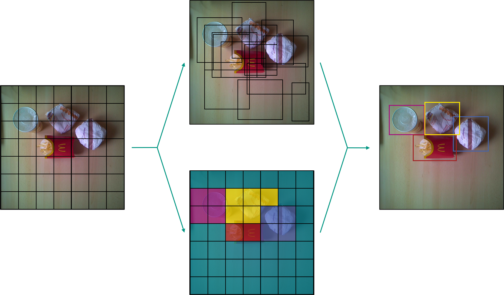
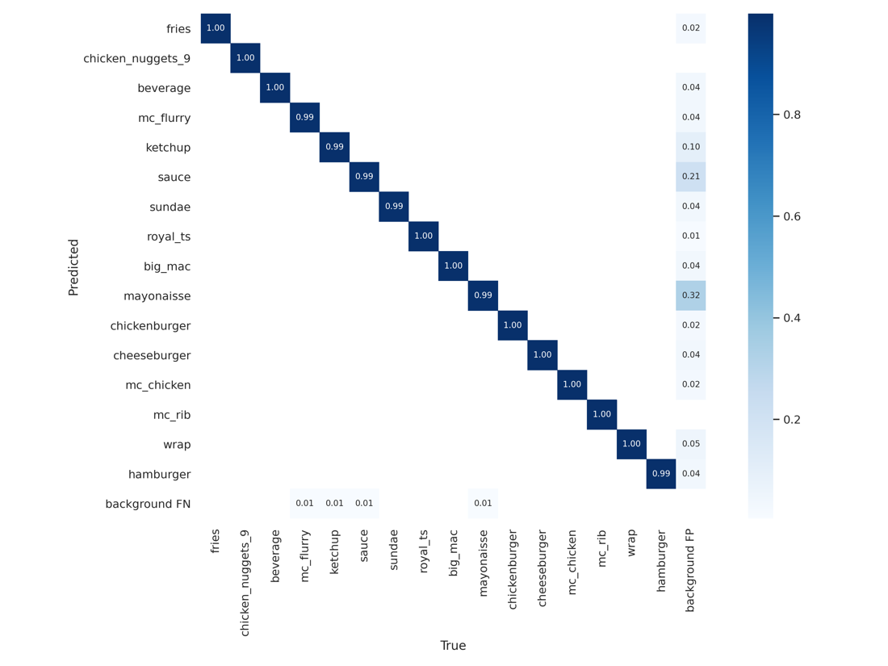
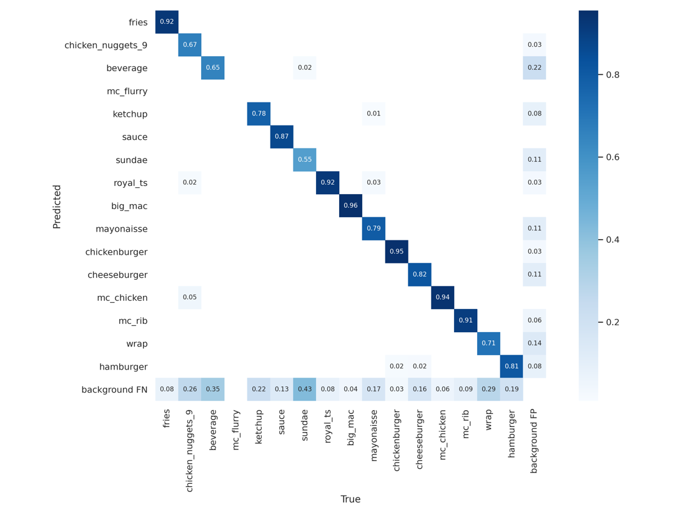
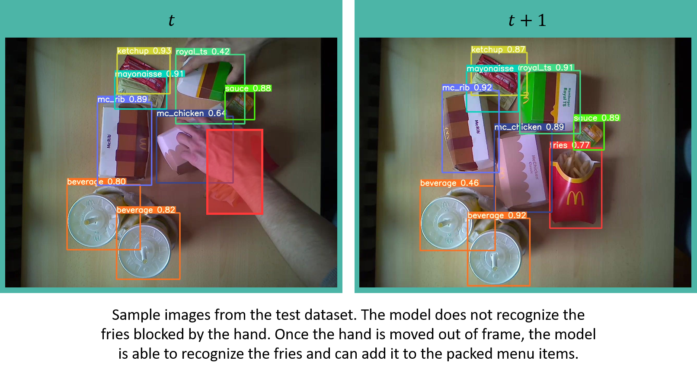

Model
=====

Computer vision challenges were initially posed by simple geometric body
detections - tasks for which neural networks were not necessarily
needed. Due to the trend with increasing availability of computing power
and the establishment of Convolutional Neural Networks (CNNs), neural
networks in general, but especially CNNs in the domain Computer Vision
have gained publicity due to very good results. For this reason, we
decided to master our object detection using such neural networks -
available in the manner of open source in different model architectures.

Model Architectures
-------------------

Since the requirements from the course are an object detection in
real-time on a Jetson Nano, we had to look for rather small neural
network architectures that perform high FPS rates (frames per second) on
relatively low processing power. For our use-case, real-time meant to be
a smooth detection at at least 8 FPS. The following figure shows
different model architectures deployed with NVIDIA's TensorRT
accelerator library on a Jetson Nano.

After further research, we decided either a model architecture from the
[Tensorflow Object Detection
API](https://github.com/tensorflow/models/tree/master/research/object_detection)
or a YOLO architecture implemented with a widespread machine learning
library like [PyTorch](https://pytorch.org/) would be the perfect fit,
since both are very well documented, and lack of time is one of our
biggest challenges.

With both libraries as possible solutions, we created training pipelines
to test several model architectures, such as the "SSD Mobilenet-V2" from
the Tensorflow Model Zoo, or a YOLOv4-CSP and evaluate their
performance.

Finally, we did not compare the performance of different YOLO model
architectures with models from the [Tensorflow
Model-Zoo](https://github.com/tensorflow/models/blob/master/research/object_detection/g3doc/tf2_detection_zoo.md),
because we decided to use Nvidia's [DeepStream
library](https://developer.nvidia.com/deepstream-sdk), which integrates
particularly well with YOLO architectures, for inference on the Jetson
Nano.

YOLO Architecture
-----------------

[YOLO](https://arxiv.org/pdf/1506.02640.pdf), an abbreviation for the
term "You Only Look Once", is a model architecture for object detection,
employing CNNs to detect in real-time. As the name indicates YOLO
architectures are single-stage object detectors.

In general, the architecture uses three techniques to achieve accurate
results with minimal error and a real-time detection.

**Residual Blocks:** 
The input-image is divided into grids of a quadratic dimension. Every
grid-cell will detect objects that appear within them.

**Bounding Box Regression:** 
The Bounding Box, as the rectangle outline of an object in an image,
consists of height and width, relative x and y center position and the
item-class. YOLO uses a single regression to align all Bounding Box
factors.

**Intersection over Union (IOU):** 
IOU is used by the YOLO architecture to provide a bounding box that fits
the object perfectly. Each grid-cell is responsible for predicting the
bounding box with its confidence score.

The above figure shows how the three techniques are applied to produce
the final object detection results.

YOLO Model Comparison
---------------------

The DeepStream-based inference solution we built for the QSROA supports
the deployment of most common YOLO architectures with very little
reconfiguration effort. In order to further streamline our development
process, we decided to use a model supported by the
[DeepStream-Yolo](https://github.com/marcoslucianops/DeepStream-Yolo)
project. As a result, we had several architectures from which we could
choose the best-suited model according to use case and hardware
restrictions.

-   [YOLOv5](https://pytorch.org/hub/ultralytics_yolov5/)

    -   available in various sizes

    -   implements CSP Bottleneck like YOLOv4-CSP

-   YOLOv4x-Mish

-   YOLOv4-CSP (Scaled/ [Cross-Stage Partial
    Networks](https://arxiv.org/pdf/1911.11929.pdf))

    -   code has some unknown issues with reproducing paper performance

    -   [outstanding
        performance](https://blog.roboflow.com/scaled-yolov4-tops-efficientdet/)

    -   CSP architecture reduces inference computation

-   YOLOv4

    -   in general, we can say YOLOv4 is [an
        improvement](https://github.com/AlexeyAB/darknet/issues/5920#issuecomment-642213028)
        to YOLOv3

-   YOLOv4-Tiny

    -   reduced network size compared to YOLOv4

    -   Faster prediction but less accuracy

-   YOLOv3-SPP ([Spatial Pyramid
    Pooling](https://arxiv.org/ftp/arxiv/papers/1903/1903.08589.pdf))

    -   useful especially for networks that have many different input
        image sizes - therefore a not necessary architecture for us

-   YOLOv3

-   [YOLOv3-Tiny-PRN](https://github.com/WongKinYiu/PartialResidualNetworks) (Partial
    Residual Networks)

    -   has a more stable performance than YOLOv3-Tiny

    -   better FPS rate than YOLO-Tiny

-   YOLOv3-Tiny

-   YOLOv3-Lite

-   YOLOv3-Nano

-   YOLO-Fastest

-   YOLO-Fastest-XL

-   YOLOv2

-   YOLOv2-Tiny

Our selection is based on detection performance, speed (FPS) and
scalability. By scalability, we refer to the ability to scale a model in
size without requiring major changes to the model architecture. After
evaluating several model architectures we decided to have a deeper
comparison of the **YOLOv4-CSP** and **YOLOv5s**. Therefore, we balanced
the pros and contra of both models.

|YOLOv4-CSP   |Pro:                       |Contra:
|------------ |-------------------------- |-----------------------------------------------------------------
|             |Research Paper available   |Low FPS (3.9FPS) or image-stutter
|             |High mAP                   |Possible overfitting because of synthetic data
|             |Native convert.            |Code has some unknown issues with reproducing paper performance

The following video is a YOLOv4-CSP trained on the COCO2017 Dataset
deployed on the Jetson Nano. Without the 5 skip frames that we apply, we
achieve a 3.9 FPS-rate in average on the Jetson Nano, which visualized
looks like a stutter from frame to frame.

|YOLOv5s   |Pro:                                               |Contra:
|--------- |-------------------------------------------------- |-------------------------------
|          |High FPS (12FPS)                                   |No paper available
|          |Potentially less overfitting                       |"non-transparent" python code
|          |Fast training time                                 |
|          |Less memory usage                                  |
|          |Performance reserve because of less memory usage   |

This video shows the YOLOv5s trained on the COCO2017 Dataset, also
deployed on the Jetson Nano, without any stutter (1 skip frame; 13 FPS),
but as you can see with a slightly worse detection performance than the
YOLOv4-CSP.

After a long evaluation and weighing up various characteristics we
decided **YOLOv5s ([Release
5.0](https://github.com/ultralytics/yolov5/releases/tag/v5.0))**, the
smallest [YOLOv5](https://pytorch.org/hub/ultralytics_yolov5/) model
would be the most suitable one for our use case. Especially due to the
high scalability and fast training time - both properties that fit very
well to the adaptivity of our approach of the synthetic dataset to
changing conditions and thus perfectly match the high flexibility we
approach to e.g. sessional changes described in the business plan.

About YOLOv5(s)
---------------

YOLOv5 is a GitHub project developed and maintained by the artificial
intelligence startup [Ultralytics](https://ultralytics.com/). The
project describes itself as a family of object detection architectures
and models pretrained on the COCO dataset. While as of now there is no
research paper available, it can still be seen as an unofficial
successor to YOLOv3 as it incorporates various architectural
advancements and new data augmentation techniques for training such as
mosaic augmentation. The project is under active development and since
the original release in June of 2020, the architecture was updated
multiple times to further improve performance. Contrary to the original
YOLO, YOLOv5 is implemented using the popular PyTorch framework.

YOLOv5 is available in four different sizes. The different sizes with
corresponding characteristics are listed in the following table.

|Model         |Size (MB)   |FPS-rate (ms)   |mAP (COCO)
|------------- |----------- |--------------- |------------
|**YOLOv5s**   |**14**      |**2.0**         |**37.2**
|YOLOv5m       |41          |2.7             |44.5
|YOLOv5l       |90          |3.8             |48.2
|YOLOv5x       |168         |6.1             |50.4

Since the characteristics of the smallest model (YOLOv5s) fit our
requirements regarding detection speed and size very well, we will focus
more on its technical details in the following (the other listed
versions only differ slightly in model layers and number of parameters).

The YOLOv5s, due to its single-stage object detection characteristic
also consists of three main parts. To extract important features from
the input image the model backbone is a [Cross Stage Partial
network](https://github.com/WongKinYiu/CrossStagePartialNetworks) (CSP).
For better model generalization the model neck is used to generate
feature pyramids like the [PANet](https://arxiv.org/pdf/1803.01534.pdf).
The final detection is done in the model head. Bounding Boxes, class
probabilities, output vector and the objectness scores are generated on
the given features.

Training-Pipeline PyTorch YOLOv5s 
---------------------------------

The programmed python script is designed to run on the BWUniCluster
because Image-Processing requires high processing power which is often
limited on personal computers. With limitations on Google Colab like
restricting training time and computing power, we decided to use the
Cluster instead.

The script used for training can be found under ``./model/train/start.sh``.

It is a simple shell script executing the training scripts found in the
repository of the original Yolov5 model. To run the training, place the
``start.sh`` script inside a clone of the Yolov5 repository:

[https://github.com/ultralytics/yolov5](https://github.com/ultralytics/yolov5)

Make sure the ``--data`` parameter links to the right dataset. In our
case the synthetic dataset we used for training:

[https://drive.google.com/file/d/116fG7o5RiESG0x1h3kxuD69LcGa73jym/view?usp=sharing](https://drive.google.com/file/d/116fG7o5RiESG0x1h3kxuD69LcGa73jym/view?usp=sharing)

Executing the script will train a model from pretrained weights. Since
we used a total of 4 GPUs on the cluster, the distributed launch
parameter is enabled. Adapt this parameter according to the resources
you have available. If your GPU runs out of memory, decrease the batch
size to a size that works with your setup.

After training, the script converts the model into TensorRT format. This
ensures optimal performance when deploying the model to the Jetson Nano.

Statistics about your training run can be found in the newly created
``./runs/train`` folder.

Results
-------

The model was trained for 100 epochs on synthetic data only. For
training the 'finetuning' hyperparameters provided by YOLOv5s were used.

The model was not trained from scratch but from weights provided by
YOLOv5s. These weights were pretrained on the
[COCO](https://arxiv.org/pdf/1405.0312.pdf) dataset. Overall, the
training took just over 8 hours on 4 Nvidia Tesla V100 GPUs.

While convergence on the validation data could be observed around the 80
epochs mark, some further hyperparameter tuning might further increase
model performance.

After 100 epochs the model performs very well on the validation dataset.
Keep in mind that the validation dataset consists of only synthetic data
as well. Surprisingly despite some heavy regularization the model still
achieves very high accuracies. In many cases, the regularization
techniques are so intense that recognizing all items in the images is
challenging even to humans. The model seems to achieve similar or even
performance than a human would on the synthetic dataset.

The final performance of the model was evaluated on a test dataset -
introduced in the dataset-section never seen before by the model. In
contrast to the validation dataset, the test dataset consists of real
images only.

Keep in mind that the test data contains highly complex data, as
explained in the dataset section. The performance figures here therefore
should be considered as a lower bound rather than a final model
performance.

Generally, the model recognized all the classes in the test dataset with
high accuracy. As expected, the confusion matrix shows the highest
accuracy in larger item-classes with very distinct features, such as the
packaging of Big Macs and the McChicken.

Problems are found with products that naturally change depending on the
environment as well as between products. A good example is the low
accuracy of sundaes. Sundaes come in a variety of different dessert
sauces, each one stirred slightly different into the ice cream, making
every sundae look unique. Additionally, ice cream tends to melt rather
quickly, so when capturing images for the test dataset the appearance
will change continuously. While this was a challenge for us, it is less
critical for real life situations in the restaurant, as the ice is
freshly prepared.

The high accuracy achieved on recognizing fries shows that these issues
can be overcome with more training data. While fries have a high
variability within their class, we could create a relatively large
amount of training data for them by simply rearranging the fries. This
seems to have greatly increased models' understanding. Our hypothesis
is that with a sufficiently large amount of training data these issues
could also be overcome for other classes.

When investigating the models' results, the model seemed to have issues
with items being partly out of frame or overlapped by other items. This
is especially the case when moving items into the frame or out of the
frame. While this issue will decrease the prediction accuracy of the
model on our test dataset, in a real world application this has little
to no significance. Since the system is observing a continuous stream of
images, missing the item for a couple of frames while it is being moved
into frame or blocked partially by a hand should not have any
consequences. In many cases, the model will be able to recognize the
item once it's fully in frame, and the logic we implemented in the
backend of our system is able to filter for items that disappear for
single frames or are falsely recognized for short time. By averaging
over a longer timeframe, we can greatly reduce the models' false
recognitions, as illustrated in the following figure.

