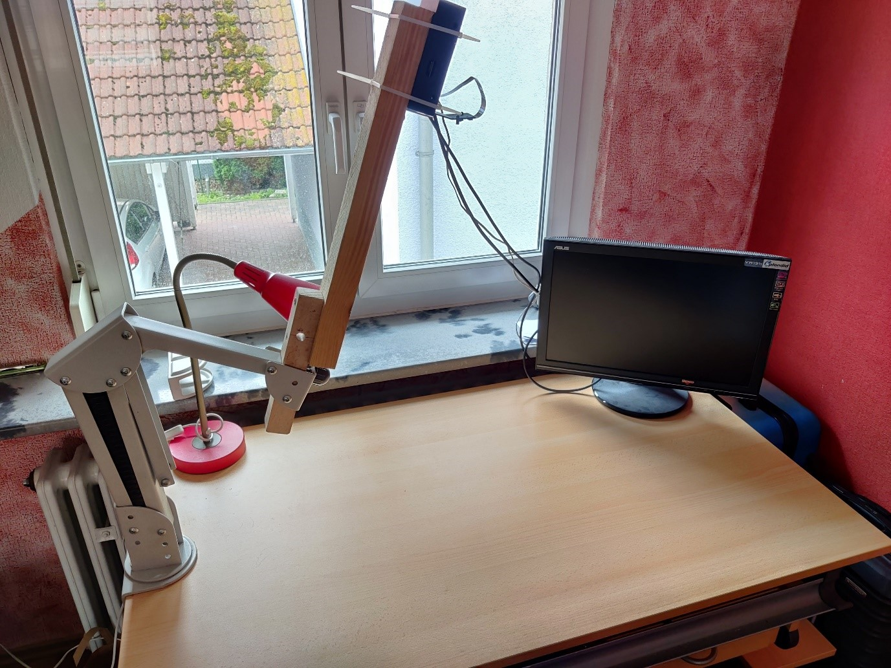

Deployment
==========

One of our main objectives of this class and its group work was to
deliver a service that was actually value-adding to a real-life problem.
Our solution had to be as practical and realistic as possible. Thus, it
was clear early on, that the deployment would play a crucial role in
achieving this goal. We did, however, manage to deliver our service in a
form deployable on a single Jetson Nano including backend as well as
frontend. Hence, we are able to present a solution that is easily
deployable on a single small and cost-effective device.

This chapter elaborates on how the deployment process of the QSROA works
and how the device can be optimally set-up for use.

Hardware Setup
--------------

With packing stations of QSRs being the main area of application of the
QSROA, we suggest a somewhat standardized setup of the hardware. 
The setup essentially revolves around the camera. We suggest that the
camera and therefore the Jetson Nano is mounted at a fixed height of one
meter above the counter. Further, we advise to place the camera in
parallel to the surface of the counter.

The Jetson itself needs to be connected to a local network via LAN. The
packing area should preferably be well lit to avoid extensive shadows.
There are no recommendations regarding the surface structure or the
color of the counter.

Docker
------

Originally, we planned to do the complete developing process on other
computers to subsequently build the Docker containers and upload them to
a container registry. On the Jetson Nano one would then only call
docker-compose to pull and start the containers.

However, this concept led us into some problems as certain steps of our
build process require the DeepStream and CUDA SDK to be present on the
build system. The latter of which is only compatible with certain Nvidia
GPUs. It may have been possible to build an adequate virtual machine to
overcome the issue, anyhow the effort required for this would not have
been justifiable.

We therefore went with an adapted concept. 
This concept includes three distinct Docker Containers: one for the
frontend, one for the backend and one for the inference. Now as before,
both frontend and backend are built on PCs. By contrast, the inference
container is being built on the Jetson Nano. 
In the following the containers are depicted in more detail.

The creation of the container for the fronted starts with the conduction
of a production build of the React application in a node.js container.
Therefore, the needed packages (``package.json``) are installed and the
source code of the application is copied into the container. The
resulting production build is then copied into a nginx container, which
we use to host the react website. nginx is a webserver software.

For the backend, the source-files as well as the requirements.txt are
copied into a python container. Then, the required packages are
installed with pip. In a final step, the backend is executed via
gunicorn, a http-server provider for python.

Nvidia actually supplies a [Docker base image for DeepStream](https://ngc.nvidia.com/catalog/containers/nvidia:deepstream-l4t), which is
used for the inference. 
All necessary libraries are installed in the Docker Container and
gst-python is being pulled and built from the GStreamer Github repo.
Next, the files from the inference folder are copied into the container,
the ``requirements.txt`` installed and ``run_server.py`` executed. ``run_server.py``
executes the deepstream pipeline and takes care of the Socket.IO
connection to the backend.

GitLab Pipeline
---------------

Originally it was planned to use a GitLab Runner for automated Docker
builds. Merge requests in the master branch would trigger the
pipeline to automatically build a new Docker container and upload it to
the container registry. 
While the pipeline worked well for the frontend, the pushing already
caused trouble. As the inference container must be built with scripts on
the Jetson Nano either way, we decided to take another path. 
Thus, we ended up outright working with build scripts. Of the two
alternatives, it came out as significantly less effortful. The fact that
a limited number of people worked on this project in a brief time span
supports this decision.

Build Scripts
-------------

As elaborated in the preceding paragraphs, both frontend and backend
Docker containers are built on PCs. Unfortunately, KIT GitLab does not
provide a container registry, so that we had to extend the project by a
GitHub account, named "aissgroup".

In the respective folders of frontend and backend, a script is available
named ``deploy-arm.sh``. These scripts build Docker Containers for the
Jetson and push them to the container registry. 
For testing purposes on Windows, there are additional scripts available
named ``deploy.sh``. They differ in a way that the Docker Containers are now
created for Windows.

Unlike front- and backend, the inference must be built with scripts
directly on the Jetson. Thus, the script named ``build.sh`` is to be
executed on the device. The script creates a temporary build folder, in
which all relevant files such as Github projects, model weights and
labels are copied. The first thing built is the ``yolov5s.engine``.
Subsequently a ``libnvdsinfer_custom_impl_Yolo.so`` Library is built by the
script. Finally, both files and ``labels.txt`` are copied into a folder
named output.

To finally deploy the whole service on the Jetson, two more scripts need
to be used. They can be found on the top level of the project folder and
are named ``build_all.sh`` and ``start_all.sh``.
Both of them must be executed on the Jetson.

``build_all.sh`` deletes all existing Docker Containers and images to be
able to conduct a clean, new build and avoid accidental uses of old
images. Following, both the frontend and the backend container get
pulled from the repository and the inference Docker Container is being
built.

After successfully running the build script, the ``start_all.sh`` script is
to be executed. The script stops all running containers and deletes
them. It then starts the three containers of the QSROA application and
exposes the following ports in the network:

-   5001 Backend Port
-   1234 Frontend Port
-   8554 RTSP Port

It was decided to go with two separate scripts for the build and the
execution as it enables repetitive starts of the application without
rebuilding.
